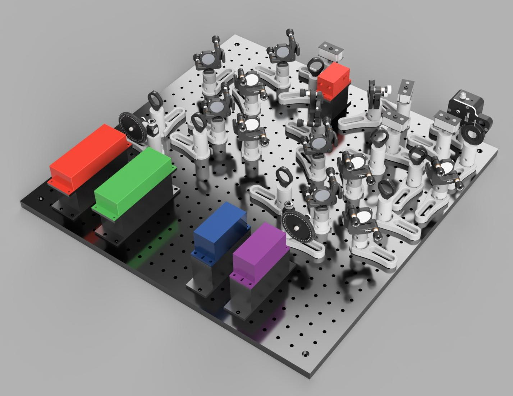
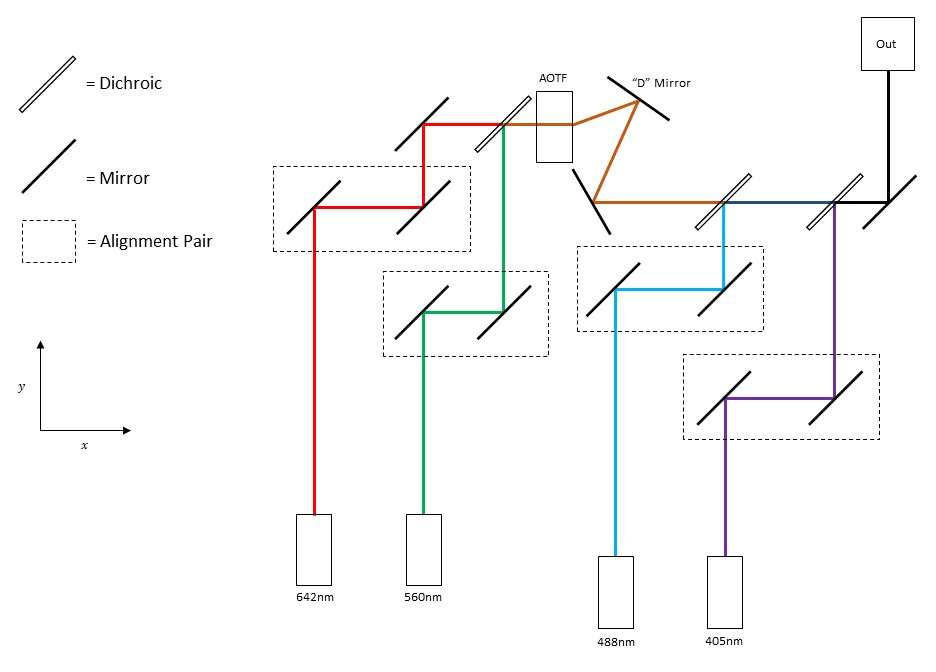

# Excitation Module

This folder contains everything needed to build the excitation module

<a href="https://a360.co/3mF2ceR"> View CAD Design</a>

## Parts

Contains .STL files for the 3D printed components. 3D printed parts were printed on an Ultimaker 2+ using PLA with triangular infill at 30% density
