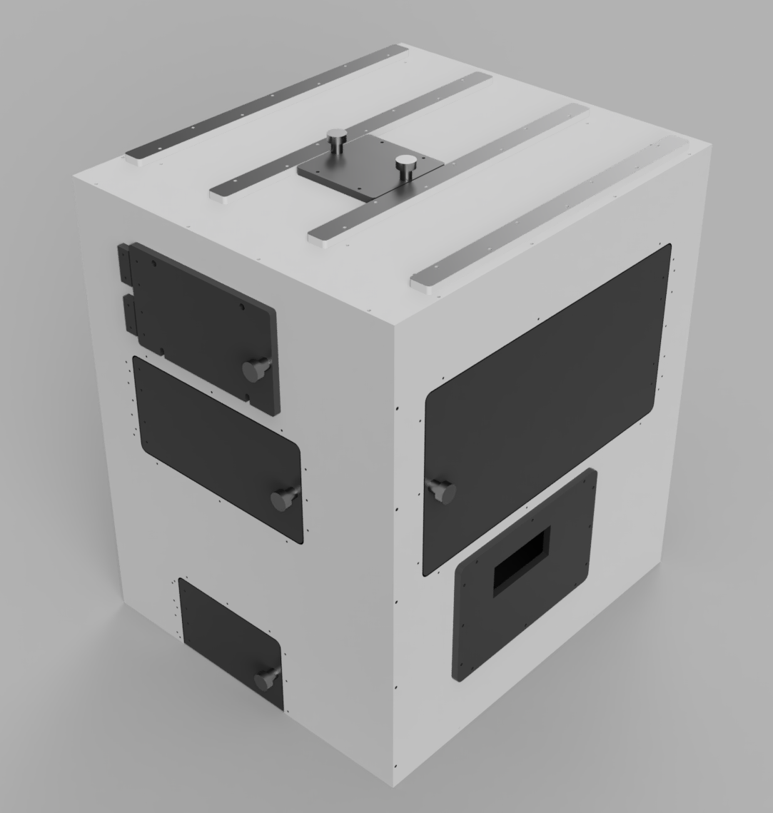

# Incubation Box

This folder contains everything needed to build the Incubation box

<a href="https://a360.co/38g8Djh">View CAD Design</a>

## Parts

Contains dimentioned 2D drawings of box components in .DXF form ready for production.

All parts are made from 10mm Black 9961 Perspex except the window which is made from 10 mm clear Perspex.
