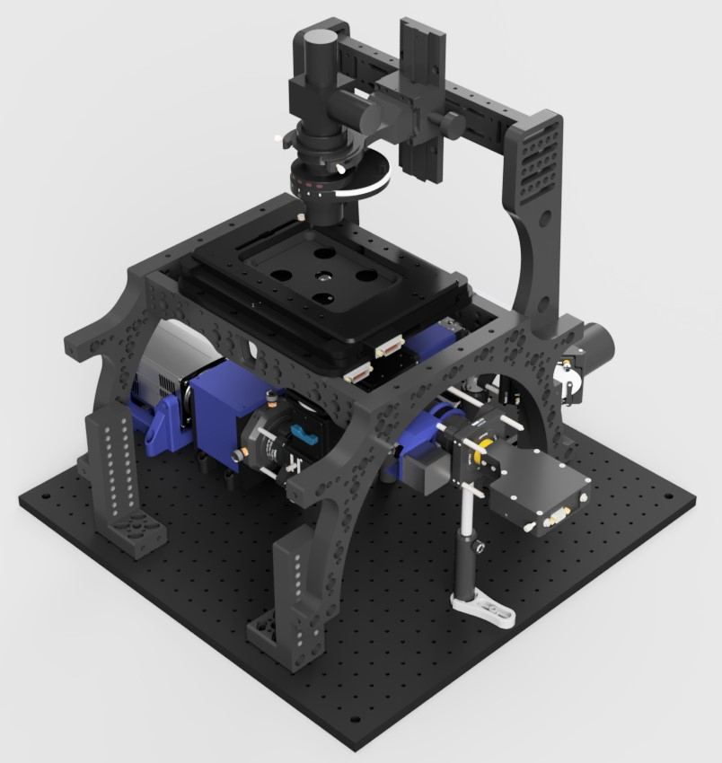
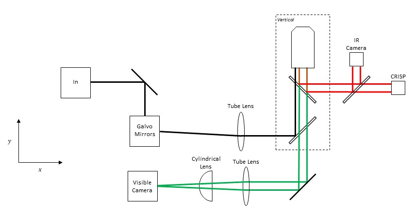

# Main Body

This folder contains everything needed to build the Main Body. This also encompasses the Image Autofocus and Focus Shifter sub-modules

<a href="https://a360.co/3p1nkNR">View CAD Design</a>

## Parts

Contains .STL files for the 3D printed components. 3D printed parts were printed on an Ultimaker 2+ using PLA with triangular infill at 30% density
