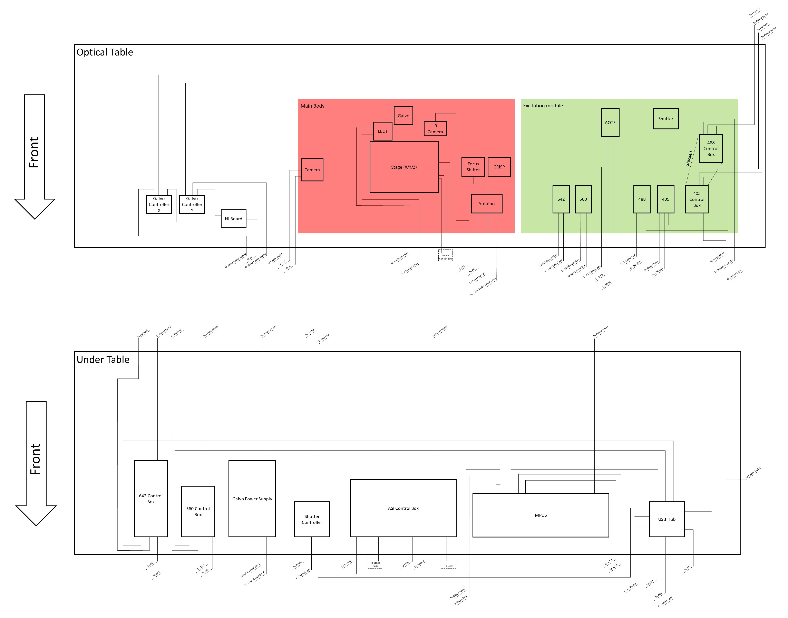

# Operation

## Control Software

Our set up uses <a href="https://micro-manager.org/wiki/Download_Micro-Manager_Latest_Release">Micromanager 2.0.0-gamma1_20201220</a>

The Triggerscope uses Micromanager specific firmware from <a href="https://github.com/micro-manager/TriggerScopeMM/">here</a>
