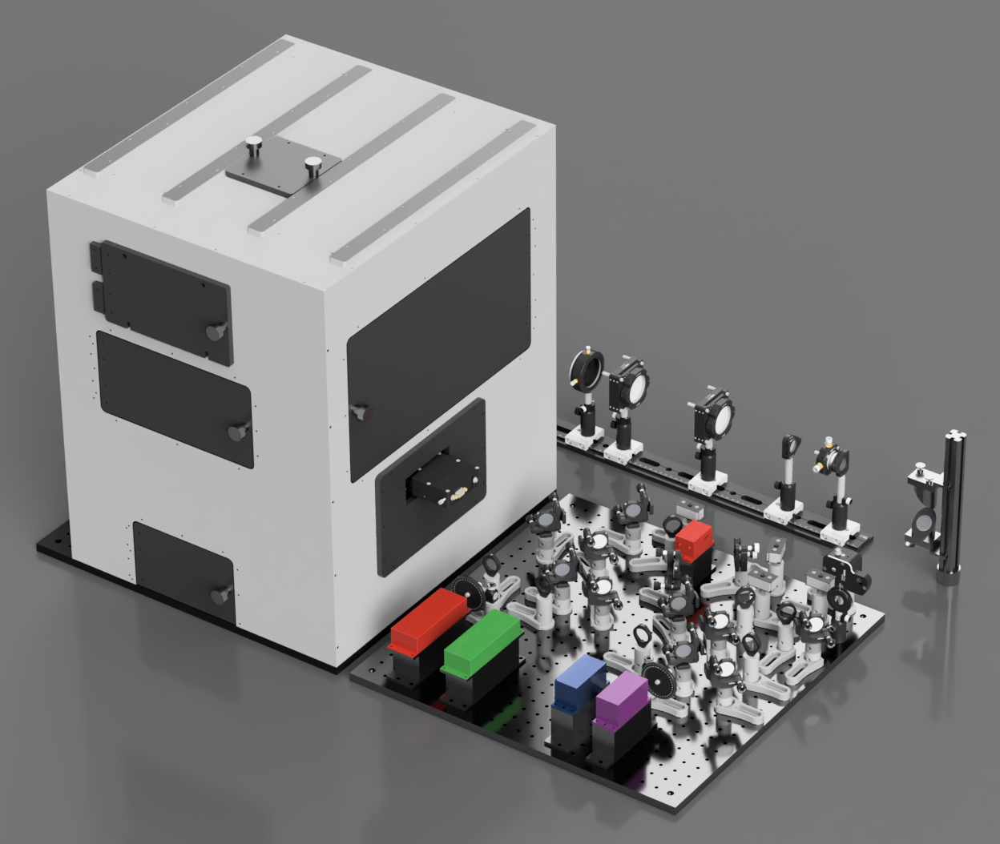

# LifeHack
**Open source SMLM microscope designs**

This GitHub repository contains all the designs needed to construct and set up your own version of the LifeHack microsope.

The full microscope CAD designs are available to view online and download through Autodesk's A360.com platform.

<a href="https://a360.co/34cZwOU">View CAD Design Online</a>

The LifeHack microscope is an open-source system designed to provide an easily modifiable, modular platform for live cell SMLM imaging. It has been contructed from comercially available and 3D printed parts to simply the build process while retaining adaptability.

For full documentation please see the <a href="">LifeHack website</a>

 This work is licensed under a <a rel="license" href="http://creativecommons.org/licenses/by-nc-sa/4.0/">Creative Commons Attribution-NonCommercial-ShareAlike 4.0 International License</a>.
